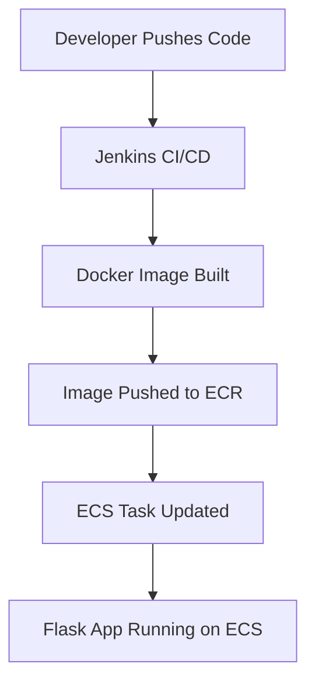

Sure! Here's a polished and professional `README.md` file for your machine learning project with a Flask app deployed on AWS ECS using Docker and Jenkins. It includes visual elements, emojis, and a clean structure to make it engaging and informative.

---

```markdown
# 🧠 ML Model Deployment with Flask, Docker, Jenkins & AWS ECS

Welcome to the repository for a production-grade machine learning project! This project encapsulates the full lifecycle of an ML model—from training to deployment—using a Flask API, containerized with Docker, orchestrated via Jenkins, and deployed on AWS ECS.


## 🚀 Deployment Architecture



---

## 🧪 Model Overview

- **Model Type**: [e.g., Random Forest Classifier]
- **Training Data**: [Brief description of dataset]
- **Purpose**: Predict [target variable] based on [features]

---

## 🌐 Flask API Endpoints

| Endpoint        | Method | Description                  |
|----------------|--------|------------------------------|
| `/predict`      | POST   | Returns prediction from model |
| `/health`       | GET    | Health check for the service |

Example request:

```bash
curl -X POST http://your-ecs-url/predict \
     -H "Content-Type: application/json" \
     -d '{"feature1": value1, "feature2": value2}'
```

---

## 🐳 Docker Setup

Build and run locally:

```bash
docker build -t ml-flask-app .
docker run -p 5000:5000 ml-flask-app
```

---

## 🛠️ Jenkins Pipeline

The Jenkins pipeline automates:

1. Code checkout
2. Docker image build
3. Push to AWS ECR
4. ECS deployment update


## ☁️ AWS ECS Deployment

- **Cluster**: `ml-app-cluster`
- **Service**: `ml-flask-service`
- **Task Definition**: Includes container image, CPU/memory, and networking

---

## ✅ Health Check

Once deployed, verify the service:

```bash
curl http://your-ecs-url/health
```

Expected response:

```json
{"status": "ok"}
```

---

## 📚 Requirements

Install dependencies:

```bash
pip install -r requirements.txt
```

---

## 🤝 Contributing

Pull requests are welcome! For major changes, please open an issue first to discuss what you'd like to change.

---

## 📄 License

[MIT License](LICENSE)

---

## 🧭 Future Improvements

- Add monitoring with Prometheus + Grafana


